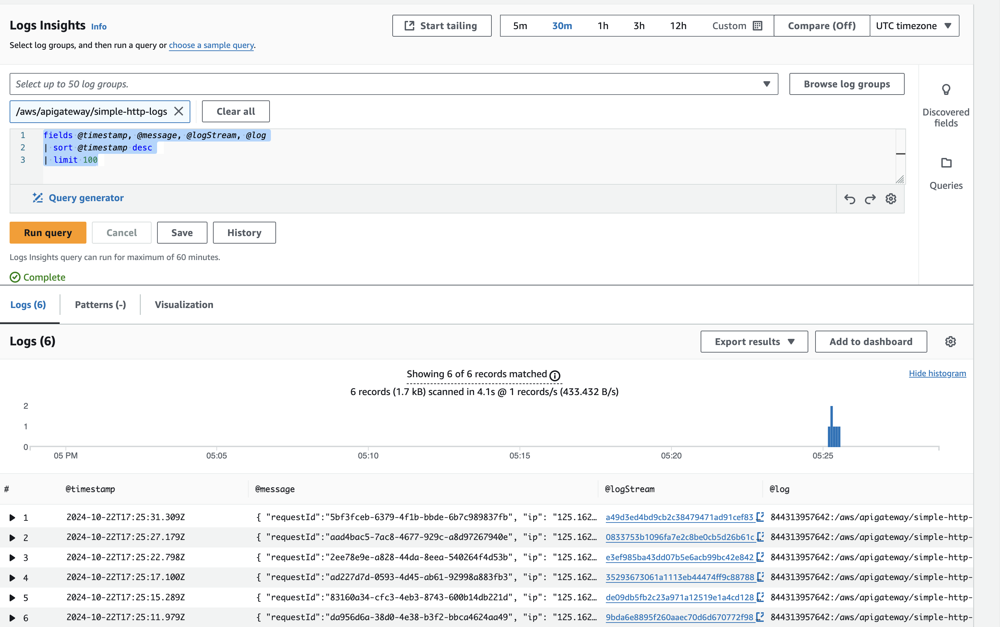
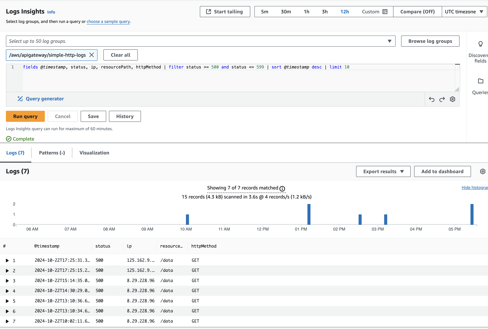

# AWS Lambda and API Gateway Logging & Query Guide

This guide provides a step-by-step overview of how to set up AWS Lambda and API Gateway logging, perform queries using CloudWatch Logs Insights, and automate the process with a Bash script. We will also show how to configure the infrastructure with Terraform.

## AWS Lambda Setup

### Python Lambda

This basic AWS Lambda function handles query parameters, headers, and request bodies to extract the greeter value. It also simulates a 500 error based on the query parameter simulate_error.
How It Works:

- Simulated Error: Add the simulate_error=true query parameter to trigger a 500 response.
- Greeter Logic: Extract the greeter value from headers, query params, or the request body.

## API Gateway Logging

Configure API Gateway to log incoming requests with a custom format:

```json
{
  "requestId": "$context.requestId",
  "ip": "$context.identity.sourceIp",
  "requestTime": "$context.requestTime",
  "httpMethod": "$context.httpMethod",
  "routeKey": "$context.routeKey",
  "resourcePath": "$context.resourcePath",
  "status": "$context.status",
  "protocol": "$context.protocol",
  "responseLength": "$context.responseLength",
  "error_message": "$context.error.messageString"
}
```

This format includes details like:

- Request ID, IP, and Request Time: Helps track individual requests.
- HTTP Method and Resource Path: Shows the route and type of request.
- Status Code and Error Message: Captures if any errors occur.

## CloudWatch Log Insights Queries

1. Requests in the Last 30 Minutes
   This query returns all requests made in the last 30 minutes from the API Gateway logs:

```Bash
QUERY_ID=$(aws logs start-query \
  --log-group-name /aws/apigateway/simple-http-logs \
  --start-time `date -d "30 minutes ago" "+%s"` \
  --end-time `date "+%s"` \
  --query-string 'fields @timestamp, @message, @logStream, @log | sort @timestamp desc | limit 10' \
  | jq -r '.queryId')

echo "Query started (query id: $QUERY_ID), please hold ..." && sleep 5

aws logs get-query-results --query-id $QUERY_ID
```



2. Find Requests with 500 Errors
   This query filters requests with HTTP status codes between 500 and 599:

```Bash
QUERY_ID=$(aws logs start-query \
  --log-group-name /aws/apigateway/simple-http-logs \
  --start-time `date -d "30 minutes ago" "+%s"` \
  --end-time `date "+%s"` \
  --query-string 'fields @timestamp, status, ip, resourcePath, httpMethod | filter status >= 500 and status <= 599 | sort @timestamp desc | limit 10' \
  | jq -r '.queryId')

echo "Query started (query id: $QUERY_ID), please hold ..." && sleep 5

aws logs get-query-results --query-id $QUERY_ID

```



Explanation:

- Log Group: Specify the correct log group for API Gateway.
- start-time and end-time: Filters logs from the last 30 minutes.
- Query String: Extracts log details like timestamp, IP, status, and filters by HTTP status code.

## Infrastructure with Terraform

Terraform simplifies the creation and management of AWS infrastructure. By using this Terraform module, we can easily deploy AWS Lambda functions with API Gateway and CloudWatch logging in an automated, repeatable manner. The module allows for flexible customization of resources, enabling you to scale and modify as needed for different environments such as test, staging, or production.

```terraform
module "apigw_lambda_module" {
  source = "./modules" # Adjust this path to the actual path of your module

  # Lambda-specific variables
  lambda_project_name   = "simple-http-logs"
  lambda_filename       = "./lambda_function.zip"          # Path to your zipped Lambda function
  lambda_handler        = "lambda_function.lambda_handler" # Python handler name
  lambda_runtime        = "python3.8"                      # Python runtime
  lambda_memory_size    = 128                              # Adjust memory size as per requirement
  lambda_timeout        = 30                               # Lambda timeout in seconds
  lambda_policy_enabled = false                            # Enable this if you want additional policies

  # API Gateway configuration
  use_api_gateway              = true
  api_gateway_resource_path    = "data"
  api_gateway_http_method      = "ANY"
  api_gateway_stage_name       = "test"
  apigw_cloudwatch_logs_format = "{ \"requestId\":\"$context.requestId\", \"ip\": \"$context.identity.sourceIp\", \"requestTime\":\"$context.requestTime\", \"httpMethod\":\"$context.httpMethod\",\"routeKey\":\"$context.routeKey\", \"resourcePath\":\"$context.resourcePath\", \"status\":\"$context.status\",\"protocol\":\"$context.protocol\", \"responseLength\":\"$context.responseLength\", \"error_message\": \"$context.error.messageString\" }"

  # Tags (optional)
  default_tags = {
    environment = "test"
  }
}
```

Explanation:

- Log Group Management: Terraform helps automate the creation of CloudWatch log groups for Lambda and API Gateway, ensuring proper organization and retention settings.
- Time Range Limitation: Terraform can provision log groups, but it lacks the ability to query logs with dynamic time ranges. This is why using Bash scripts is necessary for tasks such as querying logs from the last 30 minutes.

#### References

1. <https://github.com/OpenClassrooms/terraform-aws-lambda-apigw-module/tree/master>
2. <https://www.solo.io/topics/aws-api-gateway/aws-api-gateway-lambda/>
3. <https://docs.aws.amazon.com/apigateway/latest/developerguide/api-gateway-create-api-as-simple-proxy-for-lambda.html>
